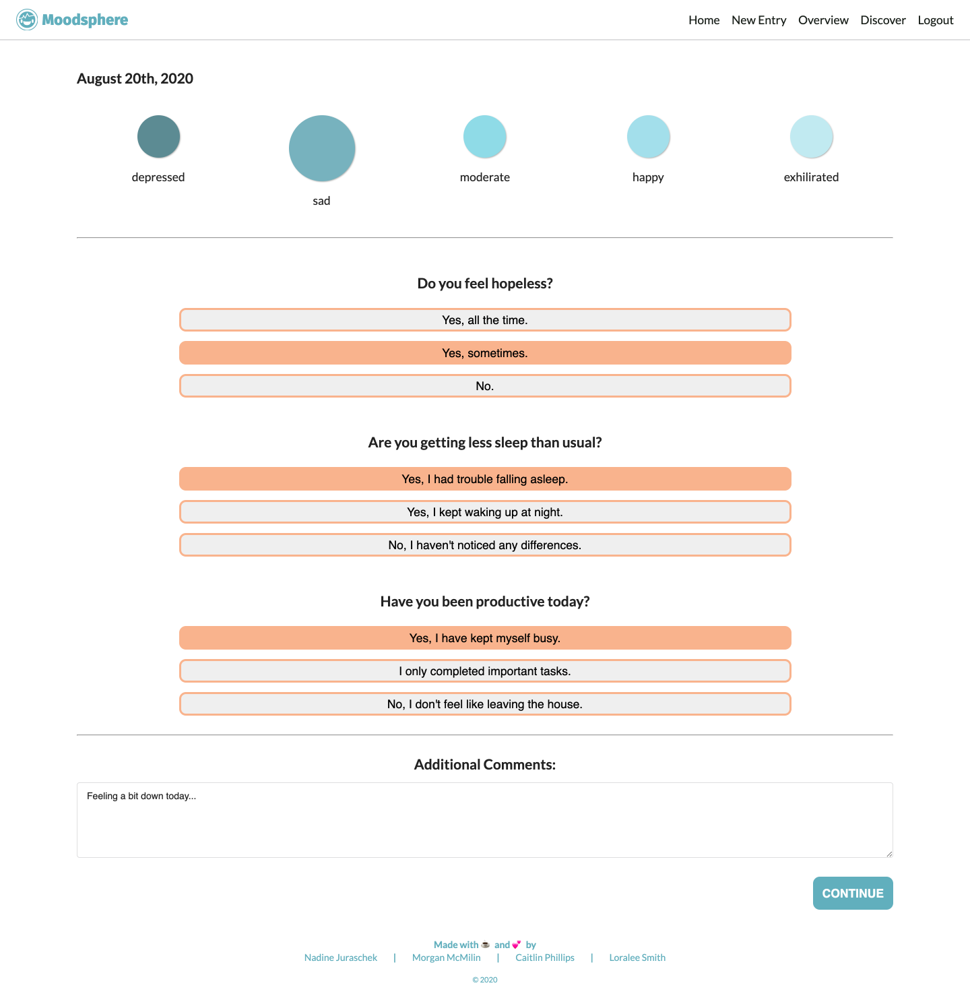

# stress reliver
## A Mental Health Tracker
### EPICS Group Project
#### https://moodsphere.herokuapp.com/

#### Test Login
Click "Use Guest Account" on the Log In Page.

### Motivation
Mental Health awareness is becoming more and more prevalent in today's culture as society is learning to focus more on it. Everyone experiences stress, anxiety, or even depression at least once in a while. Keeping track of negative as well as positive emotions can help find triggers and therefore prevent certain mental health problems.

### Project Goals
Our web application will...
* let users sign up and log in
* display the current date, weather, and an inspirational quote on a homepage
* prompt users with questions about their current mental state and let them add comments to each entry
* display all entries in an overview table
* display mood states of all entries in a graph
* offer resources to watch, listen, and read in a discover section

### Preview
#### Login

#### Home

#### New Entry

#### Overview

#### Discover

### APIs Used
* [Open Weather](https://openweathermap.org/)
* [Forismatic](https://forismatic.com/en/)

### Technologies
* JavaScript
* jQuery

* Semantic UI

* Node.js
    * express
    * express-session
    * ejs
    * dotenv
    * mongoose
    * passport
    * passport-local
    * passport-local-mongoose
    * bcryptjs

* mongoDB

### Further Development Goals
* back button on add entry page
* back to top button
* add tooltip to show each day's log when hovering over graph
* organize old javascript files/logic to work in new node setup
* create own database of inspirational quotes
* add a user profile page
* add alternative sign up methods
